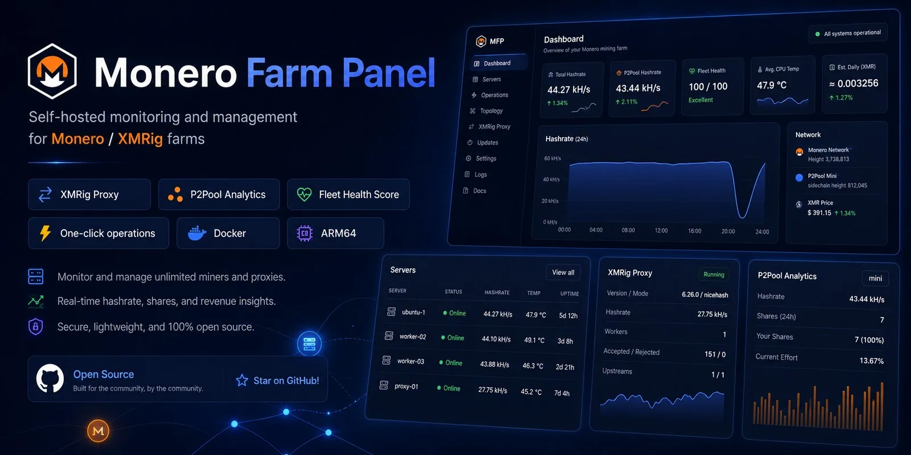
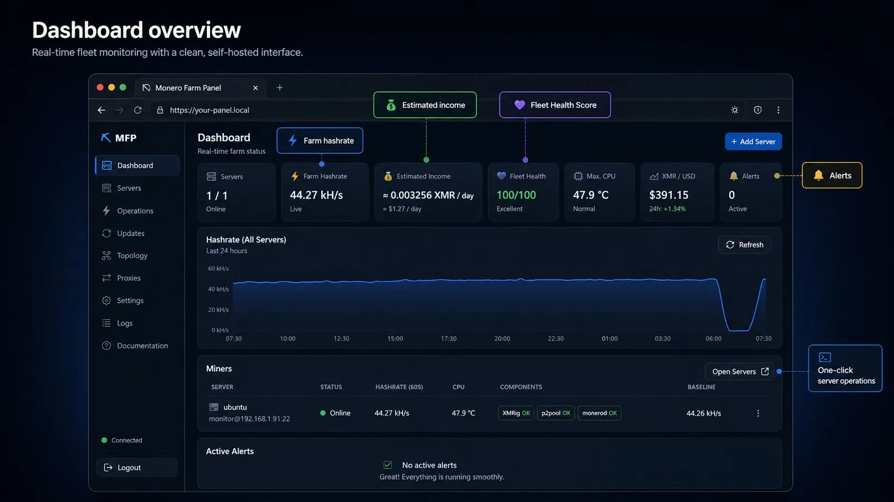

<div align="center">

# ⛏ Monero Farm Panel

**Self-hosted dashboard for centralized monitoring and management of Monero / XMRig / RandomX mining farms over SSH.**

[](../../releases)
[](../../actions/workflows/ci.yml)


[](../../stargazers)

**[Русский](README.md) · [English](README.en.md) · [Documentation](docs/) · [Releases](../../releases) · [Report a bug](../../issues/new?template=bug_report.yml) · [Request a feature](../../issues/new?template=feature_request.yml)**

</div>

<p align="center">
  
</p>

> [!NOTE]
> README artwork is a presentation visual based on the v1.2.0 interface. It communicates the product and design direction; displayed hashrate, temperatures and income values are illustrative.

## Why Monero Farm Panel

Monero Farm Panel is a lightweight central dashboard for home and small server mining farms. **No custom agent is required on miners**: the panel connects to Linux hosts over SSH, reads local APIs and system metrics, manages services and provides an interactive browser SSH terminal.

| | What it gives you |
|---|---|
| 🛰️ **Agentless** | One web interface for multiple Linux miners without installing a custom agent on every host |
| ⚡ **Safer operations** | Preflight checks, backups and rollback for risky one-click actions |
| 📊 **Deep visibility** | XMRig, XMRig Proxy, P2Pool, monerod, baseline, Fleet Health, history and income estimates |
| 🧰 **Practical self-hosting** | Windows, Linux, Docker, amd64/arm64, SSH password/key/agent and built-in terminal |

> [!IMPORTANT]
> Use this software only on systems you own or are authorized to administer. Do not expose the panel directly to the public Internet without a VPN or a properly secured reverse proxy, HTTPS and a strong master password.

## 🖥️ Interface

<p align="center">
  
</p>

The dashboard brings the farm into one view: online/offline state, total hashrate, Fleet Health Score, temperature, XMR/USD, estimated income, alerts and history. Each server has dedicated **Overview / Performance / Components / System / Logs / Management** tabs.

## 🆕 v1.2.0

### ⇄ First-class XMRig Proxy support

- dedicated **XMRig Proxy** page;
- localhost HTTP API auto-detection;
- workers, miners, accepted/rejected/invalid and upstream connections;
- one-click installation of the official stable XMRig Proxy release with SHA256 verification;
- safe XMRig routing through Proxy with config backup and automatic rollback;
- idempotent install/routing actions that avoid unnecessary restarts.

Typical route:

```text
XMRig → 127.0.0.1:3334 → XMRig Proxy → 127.0.0.1:3333 → P2Pool → Monero
```

> [!NOTE]
> XMRig Proxy hashrate is estimated from accepted shares and Proxy time windows. Over short periods it may differ from XMRig's 60-second hashrate without indicating actual performance loss.

### 🟠 P2Pool Analytics

- Data API: 15m / 1h / 24h local hashrate;
- shares found/failed, current/average effort, workers/connections;
- pool hashrate, miners, blocks and sidechain;
- one-click persistent enablement with `--data-api` + `--local-api`;
- startup-file validation, backup and rollback if P2Pool does not return correctly.

### ❤️ Fleet Health + 💰 Farm Insights

- **0–100** Fleet Health Score for each server and the farm;
- automatically learned personal hashrate baseline;
- degradation detector;
- estimated **XMR/day, USD/day and USD/30 days** using current hashrate, difficulty, block reward and XMR/USD;
- compact `ⓘ` help and a built-in **Documentation** page.

## ✨ Highlights

| Area | Capabilities |
|---|---|
| **Farm** | Live hashrate, 24h history, sparklines, XMR/USD, Fleet Health, estimated income, alerts |
| **XMRig** | 10s / 60s / 15m, version, uptime, shares, pool, logs, config operations |
| **XMRig Proxy** | Install, Proxy API, workers/miners/shares/upstreams, safe XMRig routing |
| **P2Pool** | Process/log status + Data API analytics + one-click persistent enablement |
| **monerod** | Sync, height/target, peers, difficulty, block reward, logs |
| **System** | Temperature, CPU MHz/load, Huge Pages, 1 GB Pages, MSR, DNS/Internet |
| **Automation** | Grace period, auto-recovery, baseline, degradation detector, cooldown |
| **Management** | Performance profiles, rolling restart/update, Auto Fix |
| **SSH** | Password, private key, ssh-agent, browser xterm.js terminal |
| **Security** | AES-256-GCM secrets, host-key pinning, HTTPS, audit log, backup/rollback |

## 🚀 Quick start

<details>
<summary><b>Windows 10/11</b></summary>

Node.js 20+ is required.

```text
1. Extract the release archive.
2. Run SETUP_WINDOWS.cmd.
3. Save the generated PANEL MASTER PASSWORD.
4. Run START_WINDOWS.cmd.
5. Open https://localhost:3000
```

See [docs/WINDOWS.md](docs/WINDOWS.md).

</details>

<details>
<summary><b>Linux / Raspberry Pi ARM64</b></summary>

```bash
cp .env.example .env
./scripts/generate-secrets.sh
npm install
npm run build:web
npm start
```

See [Linux](docs/LINUX.md) · [Raspberry Pi](docs/RASPBERRY_PI.md).

</details>

<details>
<summary><b>Docker Compose</b></summary>

```bash
cp .env.example .env
./scripts/generate-secrets.sh
docker compose up -d --build
docker compose logs -f panel
```

See [docs/DOCKER.md](docs/DOCKER.md).

</details>

### Official Docker image and `mfp`

The release workflow publishes multi-arch GHCR images for `linux/amd64` and `linux/arm64`. The host-side `mfp` CLI is designed for appliance/kiosk installs: it backs up state, updates the container, checks `/healthz` and automatically restores the previous image/data on failure.

```bash
mfp status
mfp backup
mfp update 1.2.0
```

See [docs/UPDATER.md](docs/UPDATER.md).

## ➕ Add a server

Minimum inputs:

```text
Name / icon
IP or hostname
SSH port
Linux username
Password / private key / SSH-agent
sudo password, when required
```

After SSH connection the panel can auto-detect XMRig, `config.json`, systemd unit, API, P2Pool, monerod, XMRig Proxy and system information.

Recommended localhost APIs:

```text
XMRig API:       127.0.0.1:60050
XMRig Proxy API: 127.0.0.1:60051
```

These HTTP APIs **do not need to be exposed to the LAN/Internet** — the panel reaches them on the host over SSH.

## 🪙 Wallet and pool safety

The public release intentionally ships with **no mining wallet configured**. Enter your own address under:

```text
Settings → Mining → XMR wallet
```

The default pool `127.0.0.1:3333` is convenient for local P2Pool and can be replaced.

## 🔐 Security

- saved SSH credentials/private keys are encrypted with AES-256-GCM;
- SSH host-key pinning helps detect host substitution;
- XMRig and XMRig Proxy HTTP APIs can remain localhost-only;
- the browser terminal is proxied through the panel's SSH backend;
- `.env`, SQLite data, certificates and runtime logs are excluded from Git;
- risky automated operations use preflight, backup and rollback where possible;
- for external access, prefer a VPN or hardened reverse proxy.

See [SECURITY.md](SECURITY.md) · [docs/SSH.md](docs/SSH.md).

## 📚 Documentation

| Get started | Mining | Operations | Development |
|---|---|---|---|
| [Windows](docs/WINDOWS.md) | [XMRig Proxy](docs/XMRIG_PROXY.md) | [Updater `mfp`](docs/UPDATER.md) | [Architecture](docs/ARCHITECTURE.md) |
| [Linux](docs/LINUX.md) | [P2Pool / monerod](docs/P2POOL.md) | [Troubleshooting](docs/TROUBLESHOOTING.md) | [Developer Guide](docs/DEVELOPER_GUIDE.md) |
| [Docker](docs/DOCKER.md) | [v1.2 Features](docs/FEATURES.md) | [SSH](docs/SSH.md) | [AGENTS.md](AGENTS.md) |

Full index: **[docs/README.md](docs/README.md)**.

## 🗺️ Roadmap

The next major UX step:

- 🇷🇺 / 🇬🇧 **Russian / English runtime UI switcher**;
- gradual alignment of the runtime UI with the new visual direction without sacrificing density or speed;
- continued improvement of onboarding and dummy-proof operations.

The visual direction is documented in [docs/DESIGN_DIRECTION.md](docs/DESIGN_DIRECTION.md).

## 🤝 Contributing

Issues and pull requests are welcome. Read [CONTRIBUTING.md](CONTRIBUTING.md) before a PR. Report security issues via [SECURITY.md](SECURITY.md).

If MFP is useful to you, a ⭐ **Star** helps other miners discover the project.

## License and independence

MIT — see [LICENSE](LICENSE).

> Monero, XMRig and P2Pool are independent projects. Monero Farm Panel is not an official or affiliated product of those projects.

## 🧩 Developers and AI coding assistants

Source code is grouped by subsystem. Start with [AGENTS.md](AGENTS.md), then [Developer Guide](docs/DEVELOPER_GUIDE.md). The canonical REST prefix is `/api/v1`.
